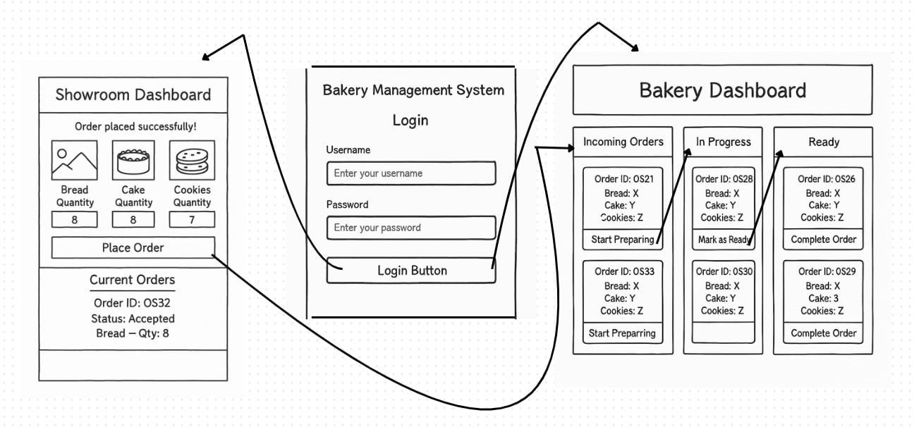
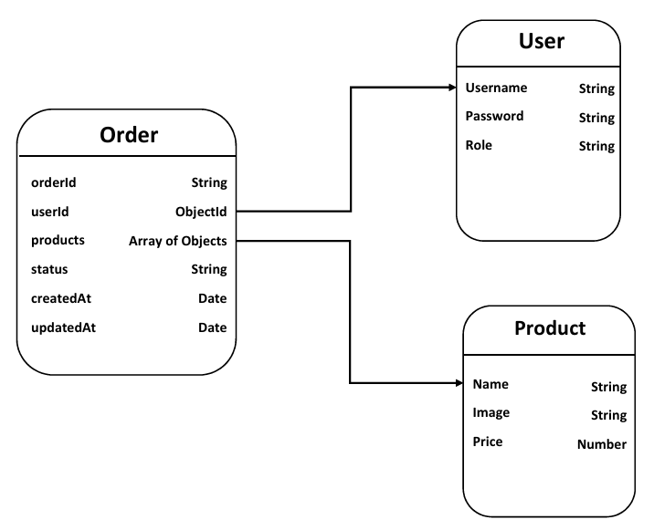
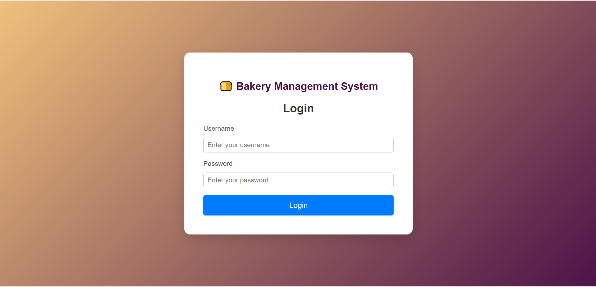
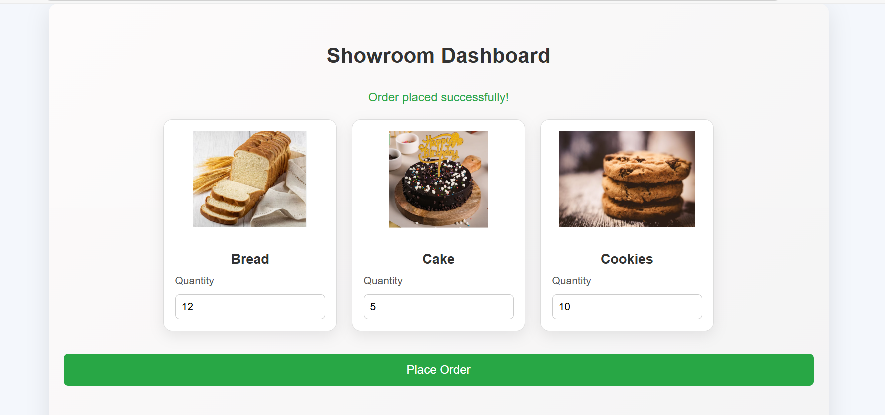
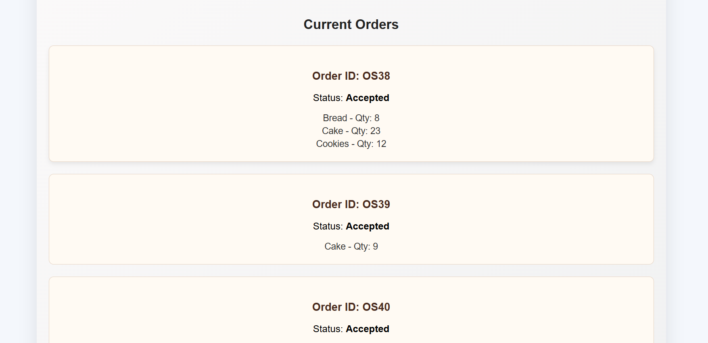
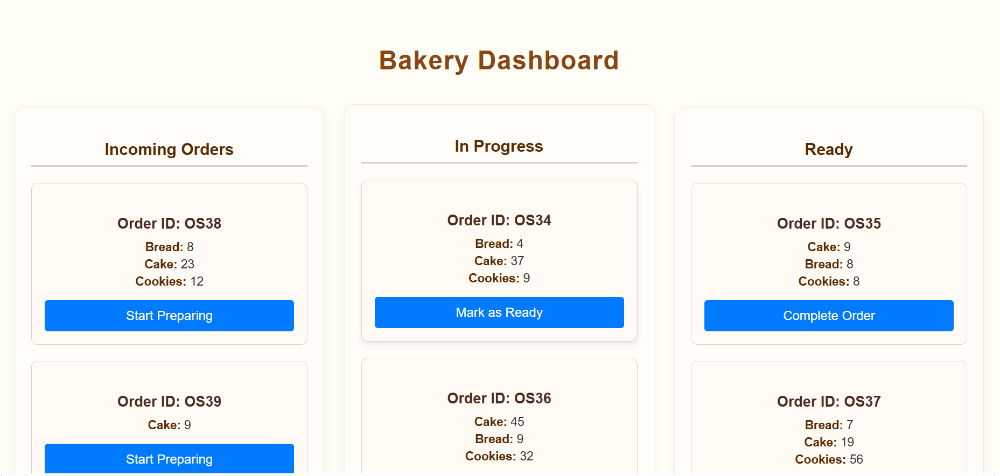

# 🍞 Bakery Management System

##  Project Overview

The **Bakery Management System** is a full-stack web application built to streamline daily operations between a showroom and a central bakery. It allows **Showroom Managers** to place and track orders in real time, while **Bakery Staff** manage the production and delivery workflow.

The platform includes:

-  Secure login with fixed roles (Showroom Manager / Bakery Staff)
-  Product listing with quantity selection and ordering
-  Real-time order status updates between dashboards
-  Complete order history tracking
-  Role-based dashboards with isolated functionalities
-  Fully responsive UI with clean design and user-friendly experience

##  Objectives

- Simplify and digitalize the bakery ordering process
- Enable real-time status synchronization between showroom and bakery
- Create a clean and minimal UI with clear order flows
- Support efficient product and order tracking across branches
- Implement a real-world backend using MongoDB Atlas

##  Tech Stack

| Layer         | Technologies                           |
|--------------|----------------------------------------|
| **Frontend**  | React.js (.jsx), Plain CSS             |
| **Backend**   | Node.js, Express.js                    |
| **Database**  | MongoDB Atlas                          |
| **Authentication** | JWT with hardcoded roles       |
| **Deployment**| Vercel (Frontend), Render/AWS (Backend)|

##  User Roles

- **Showroom Manager**
  - Login with showroom credentials
  - Select products and place orders
  - Track order statuses (New, In Progress, Ready, Completed)
  - View past delivered orders in history

- **Bakery Staff**
  - Login with bakery credentials
  - View new and in-progress orders
  - Update order statuses (In Progress → Ready → Completed)
  - Orders sync with corresponding showroom dashboard

##  Features

### Core Functionality

-  Role-based login (Showroom / Bakery)
-  Product card view with quantity selector
-  Order placement with automatic serial IDs (e.g., OS1, OS2…)
-  Real-time order tracking
-  Order history
-  Responsive design for all devices

### Administrative Features

-  Bakery staff can update order statuses
-  Only relevant orders are shown per role
-  Completed orders auto-move to history

 ## Wireframes
The design of the system is based on the following wireframes to ensure a user-friendly and intuitive interface for both showroom managers and bakery staff.

 

## Database Schema
The following schema defines the structure for managing users, products, and orders:

 

##  Folder Structure

```
bakery-management-system/
├── client/               # React frontend
│   ├── public/
│   ├── src/
│   │   ├── components/   # UI components (e.g., ProductCard.jsx)
│   │   ├── pages/        # Pages (Login, Showroom, Bakery)
│   │   ├── images/       # Product images
│   │   ├── styles/       # CSS files
│   │   └── App.jsx
├── server/               # Node + Express backend
│   ├── models/           # Mongoose models (User, Order, Product)
│   ├── routes/           # Express routes
│   ├── controllers/      # Logic for handling API calls
│   ├── config/           # DB connection
│   ├── server.js         # Entry point
│   └── .env
├── README.md
└── package.json
```

##  Setup Instructions

### Prerequisites

- Node.js
- MongoDB Atlas account
- Git

### Step 1: Clone the Repository

```bash
git clone https://github.com/arsaimon00/BMS.git
cd BMS
```

### Step 2: Set Up the Backend

```bash
cd server
npm install
```

Create `.env` in `/server`:

```
MONGO_URI=your_mongodb_atlas_uri
JWT_SECRET=your_jwt_secret
PORT=5000
```

Start the backend:

```bash
node server.js
```

### Step 3: Set Up the Frontend

```bash
cd ../client
npm install
npm start
```

Open your browser and go to:  
`http://localhost:3000`

##  Testing

-  Manual testing of login, order flows, and dashboard transitions
-  MongoDB tested for real-time updates
-  Fully functional with Vercel + Render deployment

##  Deployment

### Frontend (Vercel)

- Push `/client` to a GitHub repo
- Connect repo on Vercel dashboard
- Add environment variable: `REACT_APP_BACKEND_URL`
- Deploy

### Backend (Render/AWS)

- Push `/server` to a GitHub repo
- Connect repo to Render
- Set environment variables (`MONGO_URI`, `JWT_SECRET`)
- Deploy

##  Login Credentials (Hardcoded for Demo)

| Role             | User Name              | Password   |
|------------------|------------------------|------------|
| Showroom Manager | shwroomManager         | manager123 |
| Bakery Staff     | bakeryStaff            | staff123   |

##  Screenshots


 Login Page  

  


 Showroom Dashboard
 
 
 


Bakery Dashboard

 


##  License

This project is licensed under the **MIT License**.  
See the [LICENSE](./LICENSE) file for details.

##  Acknowledgments

This project was built as part of a university assignment.  
Special thanks to the entire team for dedication and contribution.


## API Documentation
Detailed API endpoints, including routes, methods, and request/response formats, are available in the API Documentation PDF.

 [View API Documentation](https://drive.google.com/file/d/1xy4HHH2GvljGnH9p0N76tDoH3yMFPnO5/view?usp=sharing)

